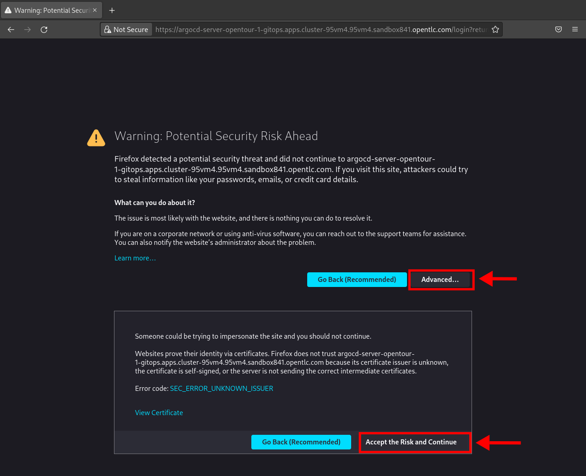
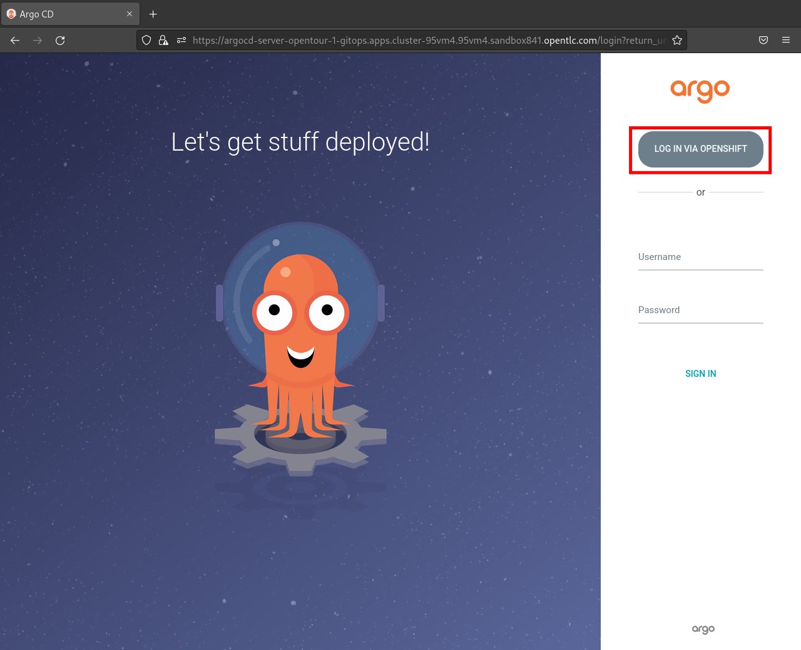

:GUID: %guid%
:APPS: %cluster_subdomain%
:USER: %user%
:PASSWORD: %password%

:markup-in-source: verbatim,attributes,quotes
:source-highlighter: rouge

== Simple GitOps Application Deployment

Open OpenShift GitOps:

https://argocd-server-{USER}-gitops.{APPS}


*Accept Certificate*








Username: {USER}
Password: {PASSWORD}


[cols="1,1"]
|===
|Field|Value 

2+|GENERAL


|Application Name
|`hello-main`

|Project Name
|`default`

|Sync Policy|`Automatic`

2+|SOURCE

|Repository URL|`https://gitea.{APPS}/{USER}/hello-gitops.git`
|Revision|`main`
|Path|`deploy/`

2+|DESTINATION
|Cluster URL|`https://kubernetes.default.svc`
|Namespace|`{USER}-hello-main`


|===


Open OpenShift Console

https://console-openshift-console.{APPS}


Open 

https://gitea.{APPS}/{USER}/hello-gitops/src/branch/main/deploy/deployment.yaml

Change 
[source,yaml,linenums]
```
          env:
            - name: LOCATION
              value: Munich
```


Open GitOps WebUi

https://https://argocd-server-{USER}-gitops.{APPS}/applications/hello-main


---------


{GUID}

{CLUSTER_SUBDOMAIN}

-u a
=> tools anschauen


[,yaml]
--------------------------
---
apiVersion: argoproj.io/v1alpha1
kind: Application
metadata:
  name: hello
spec:
  destination:
    server: https://kubernetes.default.svc
    namespace: rbohne-main
  project: default
  source:
    path: deploy {GUID}
    repoURL: https://{CLUSTER_SUBDOMAIN}/opentour-2022-hello-gitops
    targetRevision: main
--------------------------

=> Check application

-> Git tea configmap anpassen

?? wie oft sync argocdo? Autosyn on
?? C:wq
onfigMap Update -> Deployment don't update?? GitOPS solution?

=> Pipeline via Gui

=>


