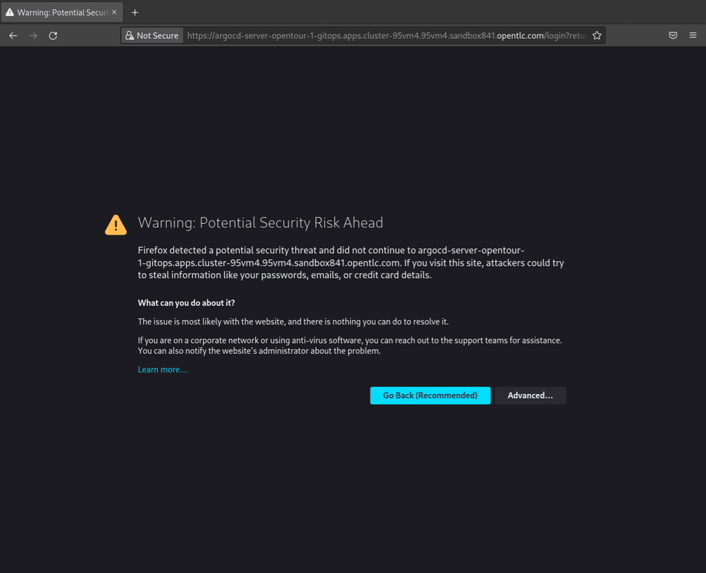
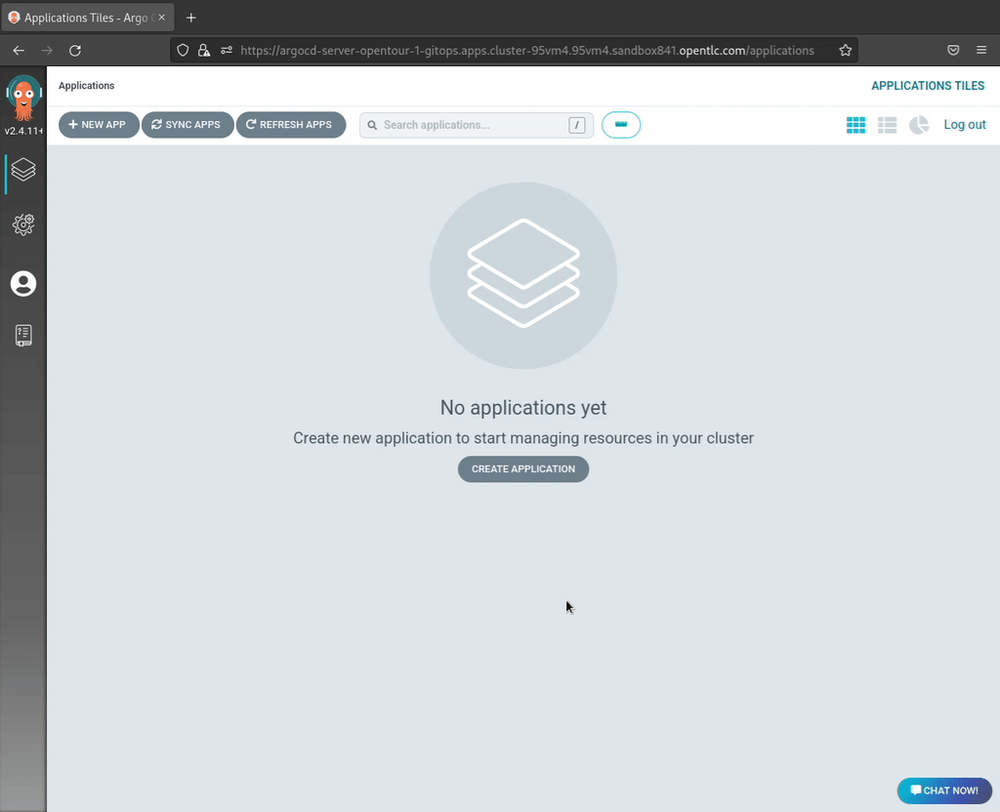
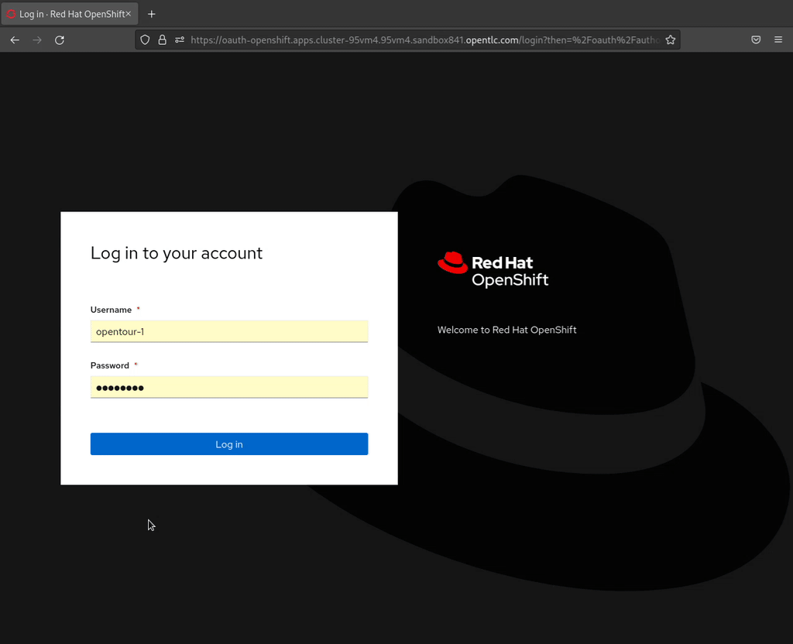
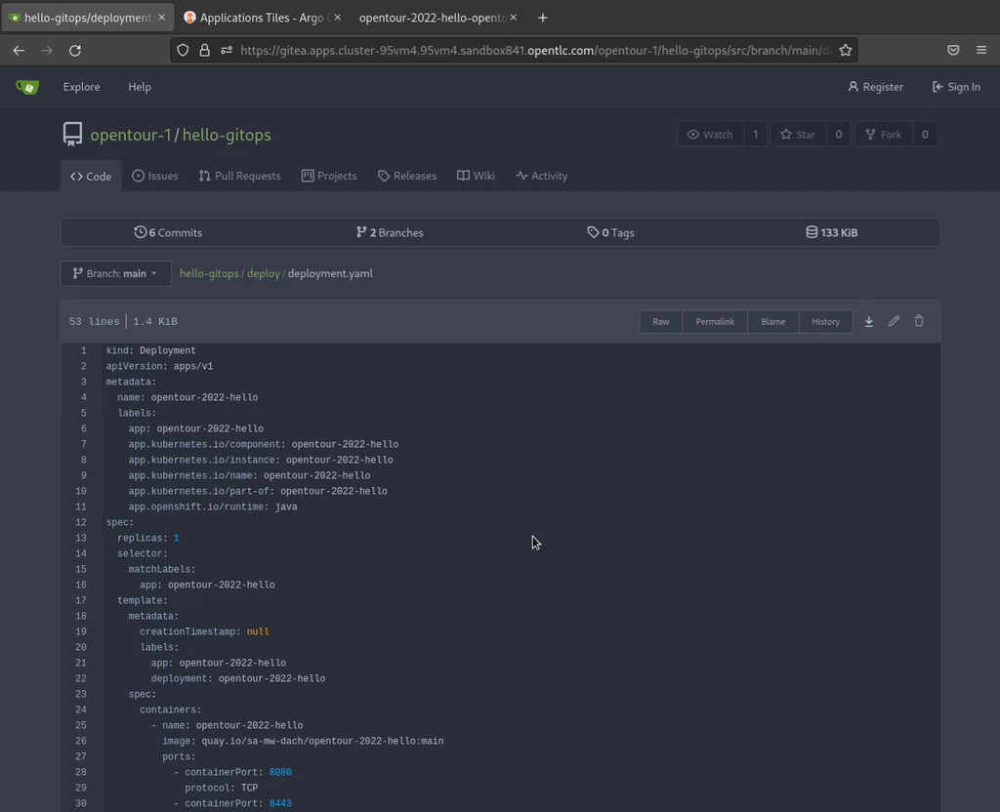

:GUID: %guid%
:APPS: %cluster_subdomain%
:USER: %user%
:PASSWORD: %password%

:markup-in-source: verbatim,attributes,quotes
:source-highlighter: rouge

== Simple GitOps Application Deployment


===== Open OpenShift GitOps:

https://argocd-server-{USER}-gitops.{APPS}


[%autowidth]
|===
h|Username|`{USER}`
h|Password|`{PASSWORD}`
|===




===== Create GitOps Application

[%autowidth]
|===

2+h|GENERAL

h|Application Name
|`apps`

h|Project Name
|`default`

h|Sync Policy|`Manual`

2+h|*SOURCE*

h|Repository URL|`https://gitea.{APPS}/{USER}/gitops.git`
h|Revision|`HEAD`
h|Path|`.`

2+h|DESTINATION
h|*Cluster URL*|`https://kubernetes.default.svc`
h|*Namespace*|`{USER}-apps`
|===



==== Fix image

Added to `kustomization.yaml`

[source,yaml,options="nowrap",subs="attributes,{markup-in-source}",role=copy]
----
# Testing:
#   kustomize edit set image app-a:latest=image-registry.openshift-image-registry.svc:5000/{USER}-apps/app-a:main
#
images:
- name: app-a:latest
  newName: image-registry.openshift-image-registry.svc:5000/{USER}-apps/app-a
  newTag: main
- name: app-b:latest
  newName: image-registry.openshift-image-registry.svc:5000/{USER}-apps/app-b
  newTag: main
- name: app-c:latest
  newName: image-registry.openshift-image-registry.svc:5000/{USER}-apps/app-c
  newTag: main

----


==== Update Pipeline with update

++++
<br/><br/><br/><br/>
<hr/>
<h1>OLD /  Backup</h1>
++++


===== Open OpenShift Console & Application URL

https://console-openshift-console.{APPS}




Application URL: https://opentour-2022-hello-{USER}-hello-main.{APPS}

===== Change application & Sync

Open three tabs:

[%autowidth]
|===
h|Gitea|https://gitea.{APPS}/{USER}/hello-gitops/src/branch/main/deploy/deployment.yaml
h|OpenShift GitOps|https://argocd-server-{USER}-gitops.{APPS}
h|Application|https://opentour-2022-hello-{USER}-hello-main.{APPS}
|===

And change in `deployment.yaml`:
[source,yaml,linenums]
```
          env:
            - name: LOCATION
              value: City
```



